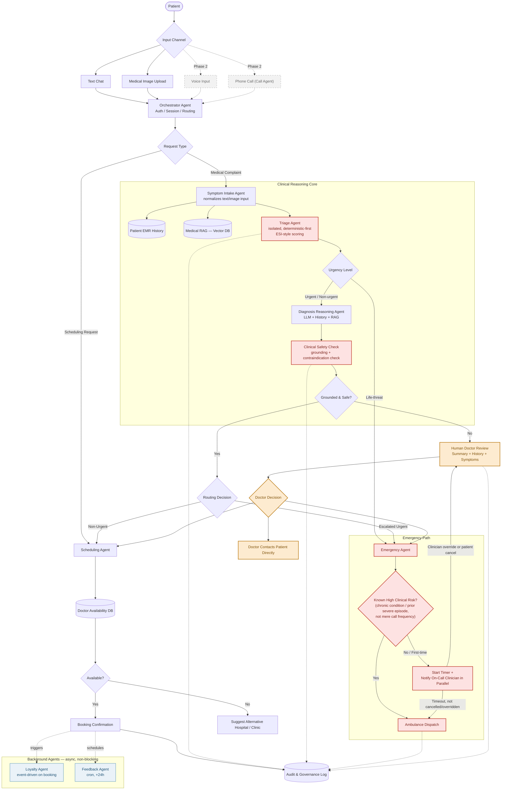

# System Design: Agentic Medical System (Hospital Patient Assistant)

**Version:** 2 (revised for safety isolation, grounding, and governance)
**Status:** Draft for engineering review

---

## 1. Overview

This system is an agentic assistant that helps hospital patients through scheduling, symptom triage, diagnosis support, and emergency response, with a human clinician kept in the loop for anything uncertain or high-stakes. It is built as a graph of specialized agents rather than one general-purpose agent, so that safety-critical functions — triage, clinical grounding, drug safety — can be validated, audited, and changed independently of the conversational and scheduling logic around them.

Version 2 exists because the original single-agent diagnosis flow combined triage, diagnosis, and routing in one step with no patient-history grounding, no verification gate before output, and an emergency dispatch path that escalated to a human only *after* a timeout rather than in parallel with it. Those gaps are closed here.

---

## 2. Goals

- Multi-modal patient interaction (text and medical image upload in the MVP; voice and phone deferred to a later phase).
- Diagnosis support grounded in the patient's own clinical history, not just general medical literature.
- Triage logic that is isolated from conversational/reasoning logic so it can be independently tested and signed off by clinical staff.
- Every diagnosis-adjacent output passes a safety gate (grounding + contraindication check) before it can trigger scheduling, escalation, or dispatch.
- Emergency detection that notifies a human clinician in parallel with any automated countdown, never only after silence.
- Appointment scheduling against real doctor availability, with graceful fallback when no slot exists.
- Loyalty and feedback handled as background, non-blocking processes that never compete with clinical flow for priority.
- Every triage, safety, and dispatch decision is logged with enough detail for medical-legal audit.

## 3. Non-Goals (MVP)

This system does not produce a definitive diagnosis or prescribe treatment — it retrieves, summarizes, and routes; a clinician makes the actual medical call wherever risk is non-trivial. It does not replace established EMS dispatch protocols; it augments hospital-side detection and notification. Real-time voice and phone/IVR integration are out of scope for the MVP and are simulated or stubbed until Phase 2.

---

## 4. Architecture Diagram

---

## 5. Components / Agents

| Agent | Role | Key Inputs | Key Outputs | Design Notes |
|---|---|---|---|---|
| Orchestrator | Authentication, session management, top-level routing | Channel message, patient credentials | Routed request, session state | Owns no clinical logic — pure traffic control |
| Scheduling Agent | Books, reschedules, or redirects appointments | Department/doctor request, patient_id | Slot confirmation or alternative suggestion | Stateless beyond the current booking transaction |
| Symptom Intake Agent | Normalizes multi-modal complaint input into structured symptoms | Text, image | Structured symptom set | First stop for any medical complaint; does not classify urgency itself |
| Triage Agent | Deterministic-first urgency scoring, isolated from reasoning logic | Structured symptoms | Urgency level (ESI-style) | Independently testable/sign-off-able by clinical staff without touching the rest of the graph |
| Diagnosis Reasoning Agent | Proposes likely department/diagnosis using patient history + medical RAG | Symptoms, EMR history, RAG context | Candidate diagnosis, confidence, department | Grounded in the patient's own record, not general knowledge alone |
| Clinical Safety Check | Verifies every claim is grounded in retrieved records and checks for contraindications | Diagnosis draft, EMR medications/allergies | Pass/fail + reason | Hard gate — nothing downstream acts on an unverified claim |
| Emergency Agent | Determines dispatch urgency and timing | Urgency level, patient risk profile | Dispatch decision, clinician notification | Notifies a clinician in parallel with any countdown, never only after it |
| HITL (Human Doctor Review) | Reviews any case that fails the safety gate, is life-threat-ambiguous, or is overridden | Patient summary, history, symptoms, suggested department | Doctor decision | Triggered on more than just "diagnosis failed" — also low confidence, contraindication, conflicting symptoms |
| Loyalty Agent | Awards points, updates patient profile | Booking completion event | Updated loyalty balance | Runs asynchronously — never blocks or competes with clinical flow |
| Feedback Agent | Post-visit satisfaction and health-status check | Appointment completion (+24h) | Stored feedback record | Cron-triggered, independent of the request path |

---

## 6. Data Layer

| Store | Content | Primary Consumers |
|---|---|---|
| Patient EMR History (PostgreSQL) | Diagnoses, medications, allergies, visit history, loyalty profile | Diagnosis Reasoning Agent, Clinical Safety Check, Emergency Agent |
| Medical RAG (Vector DB) | Clinical guidelines, condition reference material | Diagnosis Reasoning Agent |
| Doctor Availability DB | Schedules, departments, slot status | Scheduling Agent |
| Audit & Governance Log | Triage scores, safety-check results, dispatch decisions, HITL outcomes — append-only | Compliance review, model retraining, drift monitoring |

---

## 7. Core Workflows

### 7.1 Scheduling Flow
The patient requests a doctor or department appointment. The Scheduling Agent queries the Doctor Availability DB; if a slot exists, it presents options, confirms the patient's selection, and writes the booking. If nothing is available, it suggests the emergency department, another hospital, or the nearest available clinic rather than dead-ending the conversation. A successful booking asynchronously triggers the Loyalty Agent and schedules the Feedback Agent for 24 hours later — neither blocks the confirmation the patient sees.

### 7.2 Diagnosis & Triage Flow
A medical complaint goes to the Symptom Intake Agent, which normalizes text and/or image input into structured symptoms. Those symptoms go to the isolated Triage Agent for a deterministic-first urgency score. Life-threat-level urgency routes immediately to the Emergency Agent, bypassing further reasoning. Everything else proceeds to the Diagnosis Reasoning Agent, which pulls the patient's own EMR history alongside medical RAG context to propose a candidate department and diagnosis with a confidence score. That draft must pass the Clinical Safety Check — grounding verification plus a contraindication check against the patient's active medications and allergies — before anything happens with it. A failed check routes to HITL; a passed check routes to either Scheduling (non-urgent) or Emergency (escalated urgent).

### 7.3 Emergency Flow
The Emergency Agent's first action is always to check whether the patient has a documented high clinical risk profile — a known chronic condition or prior severe episode, not simply a history of frequent calls. High-risk patients get immediate dispatch. First-time or lower-risk cases start a countdown timer *and* notify the on-call clinician simultaneously, so a human is already aware before the timer ever lapses. If the timer expires without cancellation or override, dispatch is automatic; if the clinician overrides or the patient cancels, the case routes to HITL instead.

### 7.4 HITL Flow
A doctor reviewing an escalated case sees the patient summary, relevant history, reported symptoms, and the system's suggested department. The doctor's decision can route back into Scheduling, into the Emergency Agent, or result in the doctor contacting the patient directly. HITL triggers are intentionally broader than "diagnosis failed": low confidence, conflicting symptoms, a failed safety check, or a clinician override during the emergency timer all land here.

### 7.5 Loyalty & Feedback (Background)
Both agents run outside the request/response path. Loyalty points post on a booking-completion event; feedback collection runs as a cron job 24 hours after an appointment, contacting the patient, recording satisfaction and health status, and storing results for service improvement and model fine-tuning. Neither agent can delay or block a clinical interaction.

---

## 8. Safety & Governance Principles

Triage is isolated from conversational and diagnostic reasoning so it can be validated and replaced independently. No diagnosis-derived claim reaches the patient or triggers a downstream action without passing the grounding and contraindication gate. Emergency escalation to a human clinician happens in parallel with any automated timer, never only as a fallback after one expires. The decision to bypass the emergency timer is based on documented clinical risk, not on how often a patient has previously called. Every triage score, safety-check result, and dispatch decision is written to an append-only audit log for compliance review and future model retraining. HITL trigger conditions are broad by design — over-escalating is preferred to under-escalating.

---

## 9. Tech Stack

| Layer | Technology |
|---|---|
| Frontend | Next.js, React, Tailwind CSS |
| Backend | FastAPI, Python |
| Agent framework | PydanticAI, OpenAI Agents SDK, LangGraph (optional) |
| Cloud LLMs | GPT-5, Claude Sonnet |
| Local LLMs | Qwen3, Llama 4, Gemma 3 |
| Multimodal | Qwen2.5-VL, Llama Vision, GPT-4o |
| Speech-to-Text | Whisper Large V3, Parakeet |
| Text-to-Speech | Kokoro TTS, Chatterbox TTS |
| Vector database | Qdrant |
| Relational database | PostgreSQL |
| Cache | Redis |
| Task scheduling | Celery, Redis Queue, Cron |
| Monitoring | Langfuse, OpenTelemetry |

---

## 10. MVP Phasing

| Phase | Scope |
|---|---|
| 1 | Authentication, Orchestrator Agent, Patient Database |
| 2 | Scheduling Agent, Doctor Database |
| 3 | Symptom Intake Agent, isolated Triage Agent, Medical RAG, EMR-grounded history retrieval |
| 4 | Diagnosis Reasoning Agent, Clinical Safety Check, HITL |
| 5 | Emergency Agent (parallel timer + clinician notification), Audit & Governance Log |
| 6 | Loyalty Agent (async) |
| 7 | Feedback Agent (cron) |
| 8 | Voice input, Phone Call Agent |
| 9 | Monitoring, analytics, production deployment |

---

## 11. Open Risks / Decisions Needed

The exact confidence thresholds for triage, diagnosis, and grounding need clinical sign-off before launch, not just engineering defaults. "Known high clinical risk" for emergency-timer bypass needs a concrete, documented definition (which chronic conditions, which prior-episode types) rather than being left to the agent's discretion. The automatic ambulance dispatch mechanism — even with parallel clinician notification — likely needs a liability/compliance review before production use. STT confidence handling for the Phase 2 voice channel isn't yet specified and should be designed before that phase starts, given how easily a misheard symptom could misroute triage.