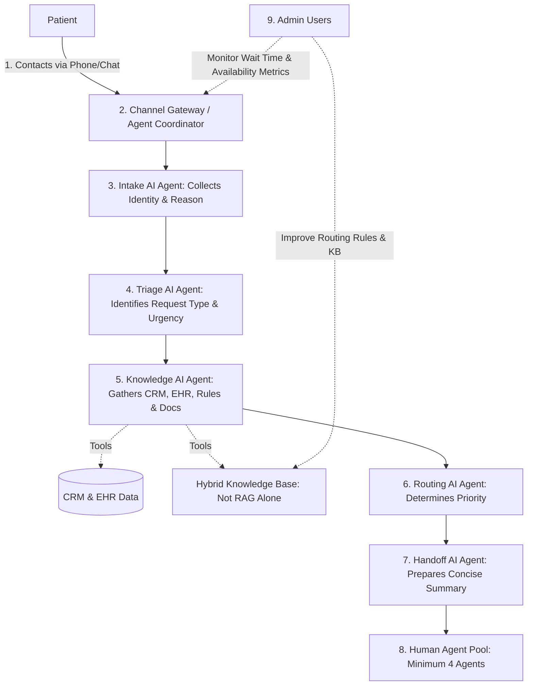

# Business Proposal: Agentic AI Patient Assistant

## Executive Summary

Patients are waiting too long to reach support, and many do not reach a human agent at all. When calls or chats are answered, agents often need extra time to understand the patient's request and search for patient history before they can help.

We propose an Agentic AI Patient Assistant that supports patients through phone and chat, understands their needs, gathers the right context, prioritizes the request, and prepares a clear handoff for a human agent.

This is not a simple chatbot. It is an agentic AI system made of multiple specialized AI agents working together. Each AI agent has a focused responsibility, such as collecting patient information, understanding urgency, checking approved knowledge sources, reviewing CRM/EHR context, routing the case, and preparing the human-agent handoff.

The result is a faster, more organized patient support experience where human agents remain in control, but receive better information earlier.

## Business Problem Statement

The client is facing a patient support problem with several connected pain points:

- Patients wait too long before a human agent answers.
- Many patients cannot find an available human agent when they call.
- Some calls become longer than needed because the agent must manually collect context.
- Some calls become too short or incomplete because the right information is not captured.
- Human agents do not always have immediate access to patient history.
- Agents may spend too much time searching databases before they can help.
- Patient loyalty or priority status is not consistently used to route support requests.

These issues affect patient satisfaction, agent productivity, and the reliability of the support operation.

## Our Proposed Solution

We propose building an Agentic AI Patient Assistant for phone and chat.

The assistant will act as the first layer of support. It will not replace the human agent. Instead, it will prepare the conversation before the agent joins, making sure the agent receives the patient request with the right context.

The solution will:

- Receive patient requests through phone and chat.
- Collect the patient's identity and reason for contact.
- Understand the patient's intent and urgency.
- Retrieve relevant context from CRM and EHR systems.
- Use approved business rules and knowledge sources.
- Prioritize cases based on urgency, availability, intent, and loyalty/status tier.
- Prepare a clear summary before handing off to a human agent.
- Help administrators monitor wait time, availability, and routing performance.

## Why Agentic AI

A traditional chatbot usually responds to questions using one conversation model and one knowledge source. That is not enough for this problem.

Patient support requires several different tasks to happen safely and reliably:

- Understanding what the patient needs.
- Identifying whether the request is urgent.
- Checking patient context.
- Applying business rules.
- Respecting loyalty or priority levels.
- Preparing a useful summary for a human agent.

An agentic AI system is better suited because it divides the work across specialized AI agents. Each agent focuses on one part of the workflow, while an agent coordinator manages the overall process.

This makes the system more organized, easier to monitor, and better aligned with real patient-support operations.

## Agentic System Overview

The proposed system includes the following AI agents:

| AI Agent | Business Role |
| --- | --- |
| Intake AI Agent | Collects patient identity and the reason for contact. |
| Triage AI Agent | Understands the request type and detects urgency. |
| Knowledge AI Agent | Uses approved documents, business rules, CRM data, and EHR data to find relevant context. |
| Routing AI Agent | Recommends where the case should go based on urgency, agent availability, intent, and loyalty/status. |
| Handoff AI Agent | Prepares a clear summary for the human agent. |

These agents are managed by an agent coordinator, which ensures the workflow happens in the right order and that each step is logged for auditability.

## User Stories

### Patient Story

As a patient, I want to contact support by phone or chat and quickly have my request understood, so that I do not wait unnecessarily for help.

### Human Agent Story

As a human agent, I want to receive a summarized handoff with patient identity, intent, priority, and history, so that I can help the patient faster and with better context.

### Admin Story

As an admin, I want to configure routing rules, loyalty priority, knowledge sources, and monitor wait/availability metrics, so that the support operation stays efficient.

## Proposed Patient Support Experience

1. The patient contacts support by phone or chat.
2. The Patient Assistant receives the interaction.
3. The Intake AI Agent collects patient identity and the reason for contact.
4. The Triage AI Agent identifies the request type and urgency.
5. The Knowledge AI Agent gathers relevant approved information from documents, rules, CRM, and EHR systems.
6. The Routing AI Agent determines the right priority and routing path.
7. The Handoff AI Agent prepares a concise summary.
8. A human agent receives the prepared case and continues the conversation.
9. Admin users monitor performance and improve routing rules or knowledge sources.

## Business Benefits

### Reduced Patient Wait Time

The assistant can begin collecting information immediately, before a human agent is available. This reduces idle waiting and helps the patient feel acknowledged.

### Improved Agent Availability

By preparing cases before handoff, agents spend less time collecting basic information and searching for history. This can help the same agent team handle more patient interactions effectively.

### Better Handoff Quality

Human agents receive a structured summary that includes patient identity, request intent, priority, channel, interaction summary, and relevant CRM/EHR history.

### More Consistent Prioritization

The system applies urgency, availability, intent, and loyalty/status rules consistently, helping important cases reach the right attention faster.

### Stronger Operational Visibility

Admins can monitor wait time, availability, and routing performance, allowing the organization to improve the support workflow over time.

## Scope of the First Version

The first version will focus on phone and chat support.

It will perform triage and handoff, not full self-service. This means the system will prepare the patient case and route it to a human agent, while the human agent remains responsible for continuing support.

The first version will include:

- Phone and chat intake.
- Patient identity and request collection.
- Intent and urgency detection.
- CRM and EHR context retrieval.
- Hybrid knowledge use through approved documents, business rules, and structured system data.
- Loyalty/status-aware routing.
- Human-agent handoff summary.
- Admin monitoring of wait time and availability.
- HIPAA-like privacy, access control, and audit logging.

## Knowledge Approach

The knowledge base will not rely on RAG alone.

Instead, the system will use a hybrid knowledge approach:

- Approved documents and FAQs for policy and general information.
- Deterministic business rules for routing and prioritization.
- CRM data for patient and case context.
- EHR data for relevant patient history.

This approach is more appropriate for patient support because it combines AI flexibility with controlled, auditable sources of truth.

## Privacy and Trust

Because the system handles patient information, it must follow a HIPAA-like privacy and security posture.

The proposal includes:

- Role-based access control.
- Audit logs for patient-information access.
- Audit logs for AI agent decisions and tool usage.
- Protected handling of patient information.
- Human handoff for patient support instead of full autonomous resolution.

## Success Metrics

The project should be measured by business outcomes, including:

- Reduced average patient wait time.
- Reduced unanswered calls and chats.
- Improved completeness of handoff information.
- Faster agent handling time after handoff.
- Better visibility into support performance.

## Implementation Roadmap

### Phase 1: Discovery and Workflow Confirmation

Confirm patient support workflows, user roles, routing rules, loyalty/status logic, and required CRM/EHR context.

### Phase 2: Agentic AI Foundation

Build the agent coordinator and the specialized AI agents for intake, triage, knowledge, routing, and handoff.

### Phase 3: CRM and EHR Connection

Connect the assistant to CRM and EHR systems through controlled access methods so the AI agents can retrieve only the context needed for handoff.

### Phase 4: Phone and Chat Integration

Connect the assistant to phone and chat channels so patients can start interactions through the approved support channels.

### Phase 5: Human Agent and Admin Experience

Build the agent view for prepared handoffs and the admin view for routing rules, loyalty tiers, knowledge sources, and performance metrics.

### Phase 6: Security and Audit Readiness

Add role-based access, audit logging, and protected handling of patient information.

### Phase 7: Pilot and Optimization

Launch a controlled pilot, measure wait time and availability improvements, review handoff quality, and improve the system based on real operational feedback.

## Expected Outcome

The proposed Agentic AI Patient Assistant will help the client move from a reactive support model to a prepared, prioritized, and more reliable support model.

Patients will be acknowledged faster. Human agents will receive better context. Admins will gain clearer visibility into the operation. The organization will have a foundation for improving patient support without removing the human agent from the center of care.
