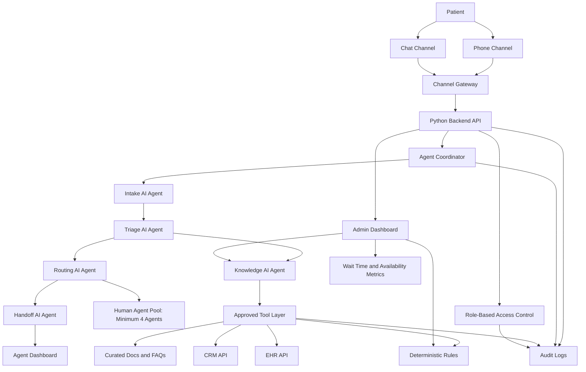

# Patient Assistant Plan

## 1. Problem Statement

Patients currently experience long wait times when contacting support, especially by phone, because they must wait until a human agent becomes available. Many patients do not find a human agent available at all, which creates missed contacts and weakens the reliability of the support experience.

The current process also creates inconsistent call handling. Some calls take longer than needed because agents must collect context manually, while other calls may be too short to capture the right patient need. Human agents may not have immediate access to patient history, or they may spend significant time fetching it from the database before they can respond effectively.

The business needs an agentic AI Patient Assistant for phone and chat that reduces wait time, improves availability, prepares human agents with relevant context, and supports tiered routing based on urgency, agent availability, intent, and loyalty/status priority.

The target outcome is a multi-agent AI triage and handoff system where specialized AI agents collect patient context, apply routing rules, retrieve relevant CRM/EHR data, use a hybrid knowledge base that is not RAG alone, and hand off prepared cases to human agents.

## 2. User Stories

1. As a patient, I want to contact support by phone or chat and quickly have my request understood so that I do not wait unnecessarily for help.

2. As a human agent, I want to receive a summarized handoff with patient identity, intent, priority, and history so that I can resolve the case faster.

3. As an admin, I want to configure routing rules, loyalty priority, knowledge sources, and monitor wait/availability metrics so that the support operation stays efficient.

## 3. Product Requirements Document (PRD)

### Product Goal

Reduce patient wait time and improve agent availability through an omnichannel agentic AI assistant that coordinates specialized AI agents for automated triage, patient-context retrieval, routing, and high-quality human handoff preparation.

### Target Users

- Patients using phone or chat support.
- Human support agents who receive patient handoffs.
- Admin and operations users who manage support rules, knowledge sources, and performance.

### Core Capabilities

- Accept patient interactions from phone and chat.
- Orchestrate specialized AI agents through an agent coordinator.
- Use an intake AI agent to manage patient identity capture and request discovery.
- Use a knowledge AI agent to combine curated documents, deterministic rules, and CRM/EHR tool calls.
- Use a routing AI agent to evaluate urgency, availability, intent, and loyalty/status tier.
- Use a handoff AI agent to prepare structured summaries for human agents.
- Capture patient identity and request reason.
- Classify patient intent and urgency.
- Retrieve relevant patient context from CRM and EHR systems.
- Use a hybrid knowledge base made of curated documents, deterministic business rules, and structured CRM/EHR API lookups.
- Apply routing based on urgency, availability, intent, and loyalty/status tier.
- Prepare a human handoff package with patient identity, intent, priority, channel, summary, and relevant CRM/EHR history.
- Provide operational monitoring for wait time and availability.

### Success Metrics

- Reduced average patient wait time.
- Reduced unanswered calls and chats.
- Improved completeness of handoff information.
- Faster agent handling time after handoff.

### Constraints

- The operational human agent pool must include a minimum of 4 agents.
- The agentic AI design must include at least 4 specialized AI agent roles: intake, knowledge, routing, and handoff.
- Patient data must be treated as protected health information under a HIPAA-like privacy and security posture.
- The knowledge base must not rely on RAG alone.
- Version 1 channels are phone and chat.
- Version 1 automation is triage and handoff, not full self-service.

## 4. Functional Requirements Document (FRD)

### Agentic AI Requirements

- The system must include an agent coordinator that manages the flow between specialized AI agents.
- The system must include an intake AI agent responsible for patient identity capture, request discovery, and channel-normalized intake.
- The system must include a triage AI agent responsible for intent classification and urgency detection.
- The system must include a knowledge AI agent responsible for selecting between curated documents, deterministic rules, CRM APIs, and EHR APIs.
- The system must include a routing AI agent responsible for routing recommendations based on urgency, availability, intent, and loyalty/status tier.
- The system must include a handoff AI agent responsible for creating the human-agent handoff package.
- The system must log agent decisions, tool calls, and handoff outputs for auditability.

### Intake Requirements

- The system must accept patient requests from phone and chat.
- The system must collect patient identity.
- The system must collect the patient request reason.
- The system must classify request intent.
- The system must detect urgency for routing and escalation.

### Knowledge Requirements

- The system must retrieve approved policy and FAQ content from curated documents.
- The system must apply deterministic business and routing rules.
- The system must query CRM APIs for structured patient and case context.
- The system must query EHR APIs for relevant patient history.
- The system must combine documents, rules, and structured APIs as a hybrid knowledge base.
- The system must not use RAG as the only knowledge mechanism.
- The knowledge AI agent must choose the appropriate knowledge source based on the task instead of treating every request as a retrieval-only question.

### Routing Requirements

- The system must route based on urgency, agent availability, intent, and loyalty/status tier.
- The system must preserve urgent-case priority while also supporting loyalty/status-based tiered routing.
- The system must maintain a minimum operational pool of 4 human agents.

### Handoff Requirements

- The system must generate a concise handoff package before agent transfer.
- The handoff AI agent must generate the handoff package from intake, triage, knowledge, routing, and CRM/EHR context.
- The handoff package must include:
  - Patient identity.
  - Request intent.
  - Priority.
  - Channel.
  - Interaction summary.
  - Relevant CRM/EHR history.
- The human agent must be able to continue support using the prepared context.

### Admin Requirements

- Admin users must be able to configure routing rules.
- Admin users must be able to configure loyalty/status tiers.
- Admin users must be able to configure knowledge sources.
- Admin users must be able to view wait time and availability metrics.

### Security Requirements

- The system must use role-based access control.
- The system must create audit logs for access to patient-related information.
- The system must protect patient information using a HIPAA-like privacy and security posture.

## 5. User Workflow

1. A patient starts an interaction through phone or chat.
2. The channel gateway normalizes the interaction and sends it to the agent coordinator.
3. The intake AI agent collects patient identity and request reason.
4. The triage AI agent classifies request intent and urgency.
5. The knowledge AI agent retrieves relevant curated knowledge and CRM/EHR context through approved tools.
6. The routing AI agent applies routing rules, agent availability, urgency, and loyalty/status priority.
7. The handoff AI agent prepares a structured handoff summary.
8. A human agent receives the prepared case and continues support.
9. An admin monitors wait time, availability metrics, agent behavior, and knowledge-source performance, then adjusts routing rules or knowledge sources as needed.

## 6. Project Structure

```text
patient-assistant/
├── frontend/
│   ├── patient-chat/
│   ├── agent-dashboard/
│   └── admin-dashboard/
├── backend/
│   ├── app/
│   │   ├── api/
│   │   ├── agents/
│   │   ├── integrations/
│   │   ├── models/
│   │   ├── orchestration/
│   │   └── services/
│   │       ├── triage/
│   │       ├── routing/
│   │       ├── knowledge/
│   │       └── handoff/
│   └── tests/
└── docs/
```

### Structure Responsibilities

- `frontend/`: Patient chat UI, agent dashboard, and admin views.
- `backend/`: Python API services.
- `backend/app/api/`: REST and WebSocket endpoints.
- `backend/app/agents/`: Specialized AI agents for intake, triage, knowledge, routing, and handoff.
- `backend/app/orchestration/`: Agent coordinator, agent state management, guardrails, and tool-call flow.
- `backend/app/services/`: Triage, routing, knowledge, and handoff logic.
- `backend/app/integrations/`: CRM, EHR, telephony, and chat provider integrations.
- `backend/app/models/`: Domain models and schemas.
- `backend/tests/`: Backend test coverage.
- `docs/`: Product and architecture documentation.

## 7. Project Architecture

The system uses phone and chat channels connected to a channel gateway. The Python backend API hosts an agentic AI orchestration layer that coordinates specialized AI agents for intake, triage, knowledge access, routing, handoff preparation, security, and audit logging.

Core architecture components:

- Patient channels: phone and chat.
- Channel gateway: telephony and chat adapters.
- API backend: Python service layer.
- Agent coordinator: manages the multi-agent workflow and shared interaction state.
- Intake AI agent: patient identity and request discovery.
- Triage AI agent: request intent and urgency.
- Knowledge AI agent: curated documents, deterministic rules, and structured CRM/EHR API lookups.
- Routing AI agent: agent availability, urgency, intent, and loyalty/status priority.
- Handoff AI agent: summary generation and case packaging.
- Tool layer: controlled access to CRM, EHR, rules, curated documents, metrics, and audit logging.
- Agent dashboard: prepared patient case view.
- Admin dashboard: routing, loyalty tier, knowledge source, and metric management.
- Audit/security layer: access control and audit logging.

## 8. Mermaid Architecture Diagram



## 9. Proposed Development Workflow

### Phase 1: Requirements Finalization and Domain Modeling

- Finalize patient, agent, admin, interaction, routing, priority, and handoff domain models.
- Define agent responsibilities for intake, triage, knowledge, routing, and handoff.
- Define shared agent state, tool permissions, and required audit events.
- Confirm CRM and EHR data required for handoff context.
- Define wait time, unanswered contact, and handoff completeness metrics.

### Phase 2: Backend Foundation

- Build the Python API foundation.
- Implement domain schemas and service boundaries.
- Implement the agent coordinator.
- Implement intake, triage, knowledge, routing, and handoff AI agent skeletons.
- Implement deterministic services used by the agents for validation, routing, and handoff formatting.

### Phase 3: CRM/EHR Integration

- Build CRM and EHR integration stubs.
- Connect real CRM and EHR adapters after interface validation.
- Add protected access patterns for patient context retrieval.
- Expose CRM and EHR access as controlled tools for the knowledge AI agent.

### Phase 4: Phone and Chat Integration

- Connect phone channel through a telephony adapter.
- Connect chat channel through a chat adapter.
- Normalize phone and chat interactions into the same intake workflow.
- Route normalized interactions into the agent coordinator.

### Phase 5: Agent and Admin Dashboards

- Build the agent dashboard for prepared handoff review.
- Build the admin dashboard for routing rules, loyalty tiers, knowledge sources, and operational metrics.

### Phase 6: Security, Audit, and Compliance Hardening

- Add role-based access control.
- Add audit logging for patient information access.
- Add audit logging for AI agent decisions, tool calls, and generated handoff summaries.
- Validate protected handling of patient information under the HIPAA-like privacy posture.

### Phase 7: Testing, Pilot Release, and Iteration

- Test intake, triage, routing, knowledge retrieval, handoff, agent orchestration, and admin workflows.
- Evaluate AI agent outputs for intent accuracy, urgency classification, routing correctness, and handoff completeness.
- Run a pilot release with phone and chat channels.
- Review wait time, unanswered contact, handoff completeness, and agent handling metrics.
- Iterate on routing rules, knowledge sources, and handoff quality.

## 10. PLAN.md Acceptance Checklist

- Includes an industry-standard problem statement.
- Includes exactly 3 distinct user stories.
- Includes a PRD.
- Includes an FRD.
- Includes a user workflow.
- Includes a project structure.
- Includes a project architecture.
- Includes a Mermaid code fence for the project architecture.
- Includes a proposed development workflow.
- Clearly represents the project as an agentic AI system.
- Includes an agent coordinator and specialized AI agents.
- Includes at least 4 specialized AI agent roles.
- Mentions phone and chat as version 1 channels.
- Mentions triage and handoff as version 1 automation.
- Mentions CRM and EHR integrations.
- Mentions that the knowledge base is hybrid and not RAG alone.
- Mentions minimum agents = 4.
- Mentions HIPAA-like privacy, auditability, and access control.
