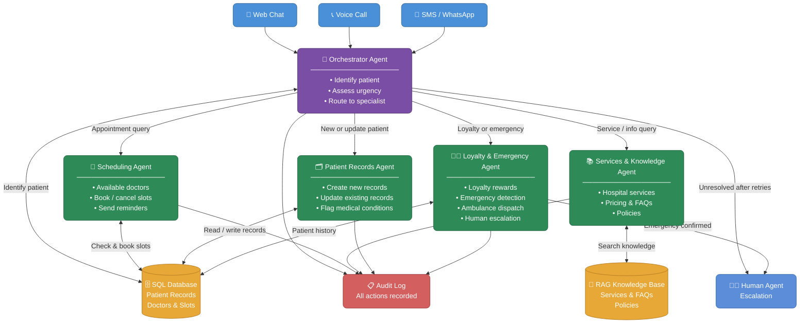
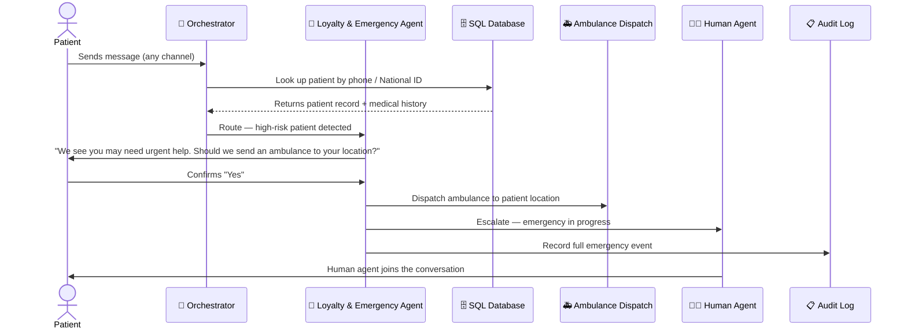
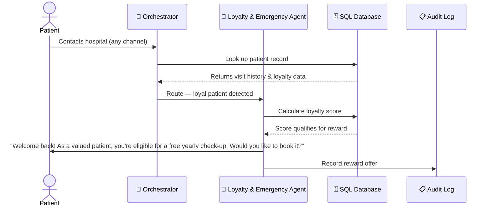

# 🏥 Hospital Customer Support — AI Agentic System
### Planning & Architecture Document

---

## 📋 Overview

This document describes the planning and architecture for an AI-powered customer support system for the hospital. The goal is to reduce patient waiting times, ensure 24/7 support availability, serve patients faster, and handle both new and returning patients — all automatically and intelligently.

---

## 😣 Problems We Are Solving

| Pain Point | What It Means | How We Address It |
|---|---|---|
| **Long waiting times** | Patients wait too long to get answers | AI responds instantly, 24/7 |
| **Limited availability** | Support is only available during working hours | System runs around the clock |
| **Long call times** | Simple questions take too long to resolve | AI resolves most queries in seconds |
| **No history for new patients** | New patients have no records in the system | System automatically creates records on first contact |
| **Outdated records** | Returning patients' info isn't updated | System updates records after every interaction |
| **No loyalty rewards** | Loyal patients aren't recognized or rewarded | System detects loyalty and offers rewards automatically |
| **No priority for high-risk patients** | Diabetic or cardiac patients wait like everyone else | System flags high-risk patients and prioritizes them instantly |

---

## 📡 Supported Channels

Patients can reach the system through any of the following:

- 💬 **Web Chat** (hospital website)
- 📞 **Voice Calls** (phone)
- 📱 **SMS / WhatsApp**

All channels connect to the same system, so the experience is consistent everywhere.

---

## 🧠 How the System Works — Simple Explanation

When a patient contacts the hospital, the system:

1. **Recognizes who they are** using their phone number or National ID
2. **Checks if they are new or returning** — creates a record if new, updates it if returning
3. **Detects if there is an emergency** — and immediately asks the patient if they need an ambulance
4. **Routes the request** to the right specialist agent depending on what the patient needs
5. **Responds quickly and accurately**, and logs every action for compliance and quality review

If the system cannot resolve a query after multiple attempts, or if there is an emergency, it **escalates to a human agent** immediately.

---

## 🤖 The Agents — Who Does What

The system is made up of **5 AI agents**, each with a specific role. Think of them like a team of specialists in a call center.

---

### 1. 🧭 Orchestrator Agent — *The Receptionist*
> The first point of contact. Talks to every patient, figures out who they are and what they need, then directs them to the right agent.

**Responsibilities:**
- Greets the patient and collects their phone number or National ID
- Looks up their record in the patient database
- Detects urgency (e.g., chest pain, emergency keywords)
- Decides which agent should handle the request
- Escalates to a human agent if needed

---

### 2. 📅 Scheduling Agent — *The Appointments Desk*
> Handles everything related to doctors and bookings.

**Responsibilities:**
- Shows available doctors and their free time slots
- Books, reschedules, or cancels appointments
- Sends reminders to patients before their appointment

---

### 3. 📚 Services & Knowledge Agent — *The Information Desk*
> Answers questions about the hospital's services, policies, and procedures.

**Responsibilities:**
- Answers questions like "What is the cost of an MRI?" or "Do you offer physiotherapy?"
- Retrieves information from the hospital's knowledge base (FAQs, service descriptions, policies)
- Handles questions that don't require access to personal patient data

---

### 4. 🗂️ Patient Records Agent — *The Medical Records Office*
> Manages patient data — creating new records and keeping existing ones up to date.

**Responsibilities:**
- Creates a new record for first-time patients
- Updates existing records after visits or interactions
- Flags medical conditions (e.g., diabetes, heart disease) so the system can prioritize correctly
- Retrieves full patient history when needed by other agents

---

### 5. 🎁🚨 Loyalty & Emergency Agent — *The Care & Crisis Team*
> Has two important jobs: rewarding loyal patients and handling emergencies.

**Loyalty Responsibilities:**
- Reviews the patient's visit history to determine loyalty level
- Offers rewards such as free yearly check-ups, discounts, or priority booking
- Personalizes the interaction based on the patient's relationship with the hospital

**Emergency Responsibilities:**
- Detects high-risk patients (e.g., history of heart attacks or diabetes)
- Asks the patient to confirm if they need an ambulance before dispatching
- Triggers ambulance dispatch upon confirmation
- Immediately escalates to a human agent for all emergency cases

---

## 🗄️ Data & Knowledge Sources

The system relies on two types of data storage:

| Type | What It Stores | Used By |
|---|---|---|
| **SQL Database** | Patient records, medical history, doctor schedules, appointment slots | Orchestrator, Scheduling, Patient Records, Loyalty & Emergency |
| **RAG Knowledge Base** | Hospital services, FAQs, pricing, policies, procedures | Services & Knowledge Agent |

> **RAG** (Retrieval-Augmented Generation) means the AI can search through hospital documents and give accurate, up-to-date answers — like a very smart search engine over the hospital's own content.

---

## 🔒 Shared Infrastructure

### Audit Log
Every action taken by every agent is automatically recorded. This includes:
- Who was contacted and when
- What information was accessed or updated
- Whether an emergency was triggered
- Any rewards offered

This is essential for **hospital compliance, quality assurance, and legal accountability**.

### LangGraph (State Management)
The system is built on **LangGraph**, a framework that automatically passes patient context between agents during a conversation. This means:
- The patient never has to repeat themselves
- All agents share the same up-to-date information throughout the interaction

---

## 🔄 System Architecture Diagram

The diagram below shows how the system is structured and how information flows between agents.

---

## 🚨 Emergency Flow — Step by Step

This is what happens when a patient signals an emergency (e.g., "I'm having chest pains"):

---

## 🎁 Loyalty Flow — Step by Step

This is what happens when a loyal patient contacts the hospital:

---

## ✅ Summary

| Component | Decision |
|---|---|
| **Architecture Pattern** | Central Orchestrator (hub & spoke) |
| **Framework** | LangGraph (manages state between agents) |
| **Number of Agents** | 5 agents |
| **Channels** | Web Chat, Voice, SMS, WhatsApp |
| **Patient Identification** | Phone number OR National ID |
| **Knowledge Bases** | SQL Database + RAG Knowledge Base |
| **Emergency Handling** | Patient confirms → Ambulance dispatched → Human escalated |
| **Loyalty Handling** | Detected automatically from visit history |
| **Human Escalation** | On repeated failures OR any emergency |
| **Compliance** | Full Audit Log of all agent actions |

---

*Document prepared for planning purposes. Architecture is subject to refinement during the technical design phase.*
